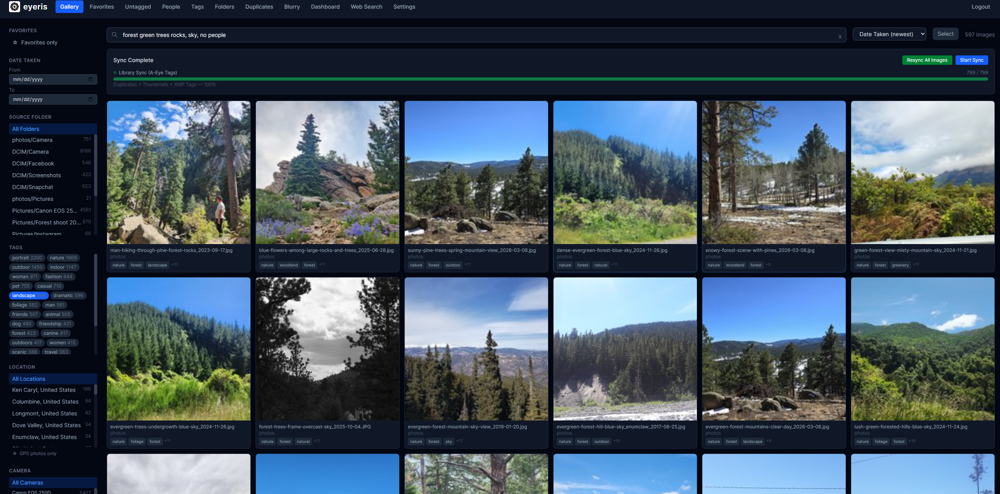
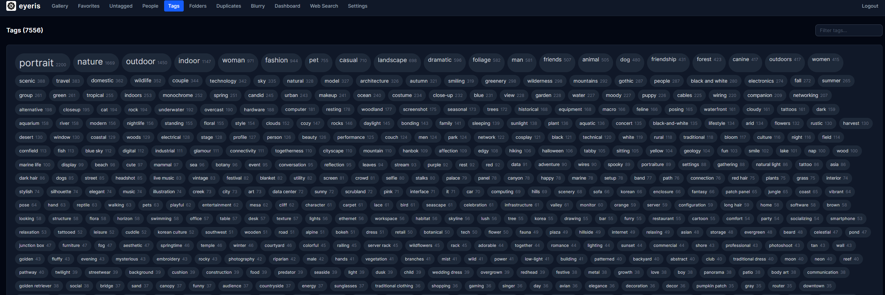
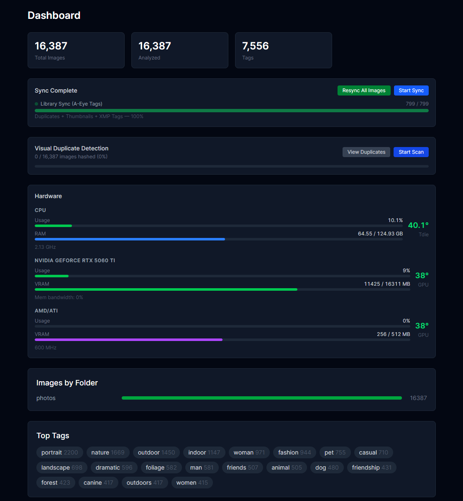
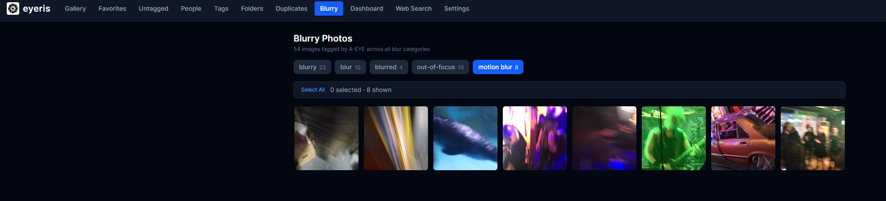

<p align="center">
  
</p>

<p align="center">
  <a href="https://github.com/vonhex/Eyeris/releases/latest"></a>
  <a href="https://github.com/vonhex/Eyeris/pkgs/container/eyeris"></a>
  <a href="LICENSE"></a>
</p>

> Self-hosted photo manager with AI tag ingestion. Your Pictures. Fast. Easy. Simple.

> [!WARNING]
> **Eyeris is designed for use on a trusted local network only.** It has no brute-force protection on the login endpoint, no multi-user access control, and image URLs embed session tokens that appear in server logs. Do not expose it directly to the internet. If you need remote access, use a VPN or put it behind Cloudflare Access — not a plain public tunnel.

---

## 📖 Documentation
Detailed guides, technical architecture, and API specs are available in the **[Project Wiki](https://github.com/vonhex/Eyeris/wiki)**:

- **[Installation Guide](https://github.com/vonhex/Eyeris/wiki/Installation)** (Docker, Linux Script, Manual Source)
- **[Video Support](https://github.com/vonhex/Eyeris/wiki/Video-Support)** (Metadata, playback, and limitations)
- **[AI Integration (A-EYE)](https://github.com/vonhex/Eyeris/wiki/AI-Integration-(A-EYE))** (How semantic search works)
- **[API Reference](https://github.com/vonhex/Eyeris/wiki/API-Reference)** (Endpoints and Authentication)

---

## 🚀 Quick Start (Docker)
The fastest way to get Eyeris up and running:

```bash
docker run -d \
  --name eyeris \
  -p 8000:8000 \
  -v ./thumbnails:/data/thumbnails \
  -v ./db:/data/db \
  -e SMB_HOST=192.168.1.x \
  -e SMB_USERNAME=youruser \
  -e SMB_PASSWORD=yourpass \
  -e SMB_SHARES=photos,media \
  ghcr.io/vonhex/eyeris:latest
```

Open `http://localhost:8000`. On first load, the default login is **`eyeris`**. Change your password immediately in **Settings**.

---

## 🖼️ Application Screenshots

### Gallery & Search


### AI Tag Cloud


### System Dashboard


### Blurry Photo Detection


---

## License

[PolyForm Noncommercial License 1.0.0](LICENSE) — free to use and modify, not for commercial use or resale. For commercial licensing contact necropsyk@gmail.com.
