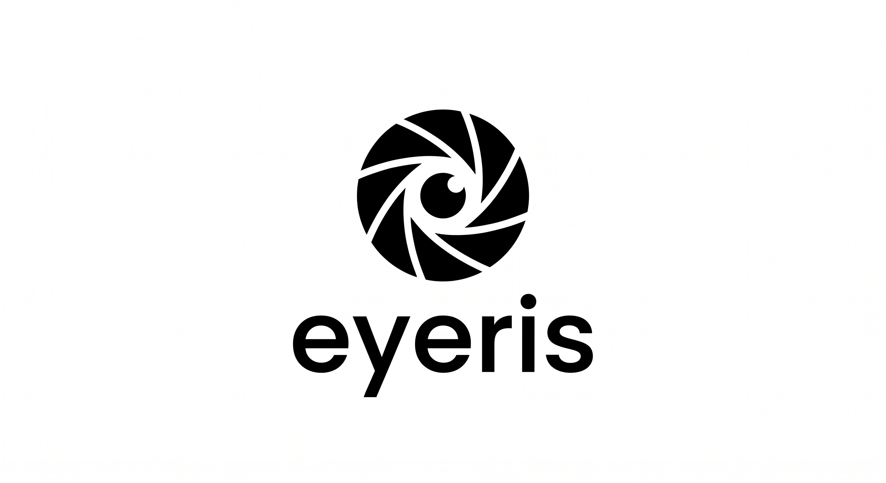
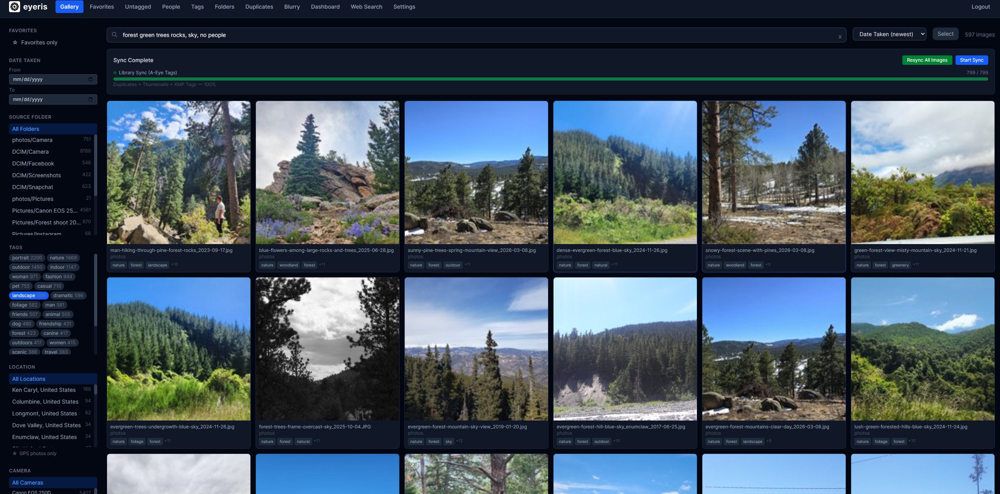
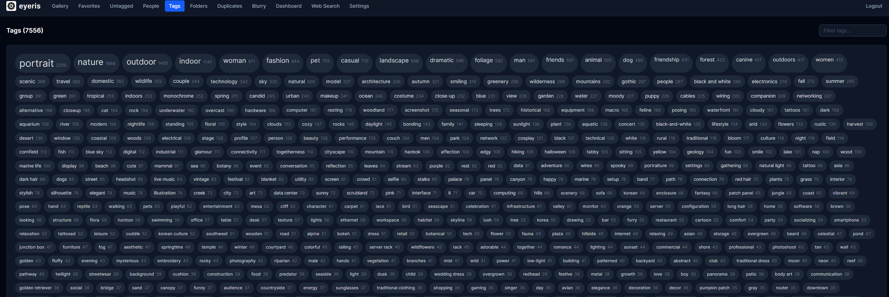
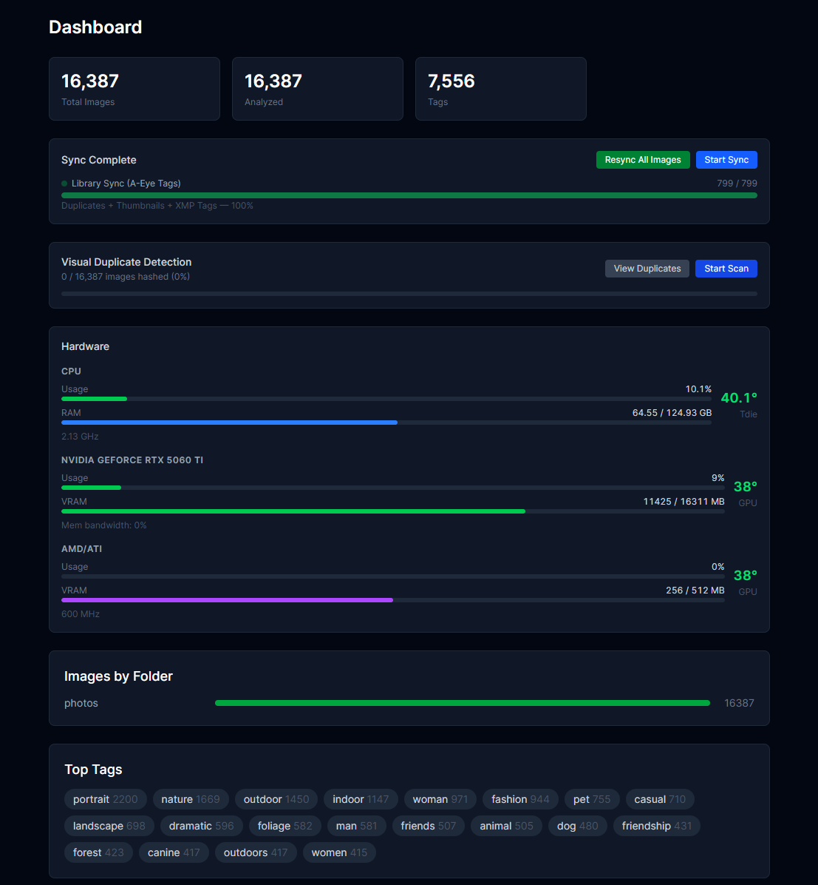
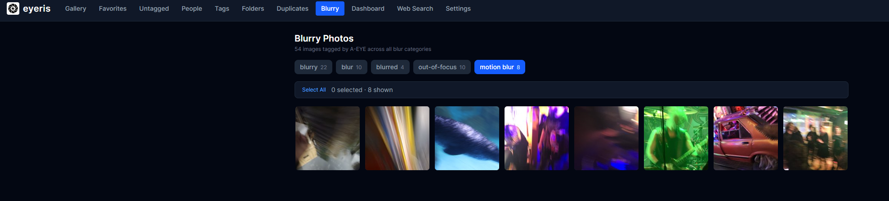

<p align="center">
  
</p>

<p align="center">
  <a href="https://github.com/vonhex/Eyeris/releases/latest"></a>
  <a href="https://github.com/vonhex/Eyeris/pkgs/container/eyeris"></a>
  <a href="LICENSE"></a>
</p>

<p align="center">Self-hosted AI photo manager. Your Pictures. Fast. Easy. Simple.</p>

> [!WARNING]
> **Eyeris is designed for use on a trusted local network only.** It has no brute-force protection on the login endpoint, no multi-user access control, and image URLs embed session tokens that appear in server logs. Do not expose it directly to the internet. If you need remote access, use a VPN or put it behind Cloudflare Access — not a plain public tunnel.

---

## How do I install it?

| Who it's for | Method | Guide |
|---|---|---|
| **Unraid users** | Manual install via template — see the wiki | [Unraid →](https://github.com/vonhex/Eyeris/wiki/Installation#path-1-unraid) |
| **Everyone else** (Linux / Windows / macOS with Docker) | Run `./docker-start.sh` | [Docker →](https://github.com/vonhex/Eyeris/wiki/Installation#path-2-docker) |
| **Developers** | Run `./start.sh` — Python + Node directly, no Docker | [Dev →](https://github.com/vonhex/Eyeris/wiki/Installation#path-3-developer--manual) |

> Not sure? **Use the Docker path.** It works on any OS and handles everything automatically.

---

## Quick Start (Docker)

```bash
# 1. Clone the repo
git clone https://github.com/vonhex/Eyeris.git
cd Eyeris

# 2. Run the start script — it will create .env and tell you what to fill in
chmod +x docker-start.sh
./docker-start.sh

# 3. Edit .env with your NAS credentials (SMB_HOST, SMB_USERNAME, etc.)
nano .env

# 4. Run again — pulls the image and starts the container
./docker-start.sh
```

Open **http://localhost:8000** — default username is `eyeris`, password is set on first run.

---

## Features

### Gallery & Browsing
- Infinite-scroll gallery with thumbnails, favorites, and multi-select bulk actions
- Filter by tag, category, album, folder, camera, location, date range, GPS, or quality issue
- Sort by date taken, date added, filename, or random
- Video support (MP4, MKV, MOV, AVI, WebM and more) with thumbnail preview
- **Untagged view** shows both images and videos with no tags yet

### Image Viewer
- **Desktop:** mouse-wheel zoom (up to 8×), click-drag to pan, double-click to toggle zoom, keyboard ← → to navigate
- **Mobile:** full-screen view, pinch-to-zoom, horizontal swipe to navigate between images, swipe-up bottom sheet to reveal metadata and editing controls
- Scroll-to-top button appears site-wide when scrolling long pages

### AI Analysis
- **SigLIP** zero-shot tag classification against ~300 candidates — runs locally on GPU during scan
- **YOLOv8 + FaceNet** face detection and 512-d embeddings for People clustering
- **XMP sidecar ingestion**: tags and descriptions written by external tools are read automatically during scan

### A-Eye Integration
- Connect to a self-hosted [A-Eye](https://github.com/vonhex/a-eye) instance from the Settings page
- **Send untagged images and videos to A-Eye** for AI analysis with one click from the Dashboard
- Video thumbnails are sent automatically when a video has no tags
- Tags and descriptions written by A-Eye are **auto-imported every 5 minutes** — no manual re-import needed
- Supports HTTP Basic Auth for protected A-Eye instances
- A-Eye URL, username, and password persist across container updates

### Metadata & EXIF
- Date taken, GPS location with OpenStreetMap link, reverse-geocoded city/country
- Camera make/model, lens model, aperture, shutter speed, ISO, focal length

### Organisation
- Tag editor per image + bulk tag editor across selections
- Category and album assignment
- **People page**: face clusters with optional name labels and adjustable sensitivity slider (Loose → Strict)
- Duplicate detection via perceptual hash

### System
- Two-phase async scan pipeline with live progress bar
- File-watcher for near-real-time new image detection
- Settings page with runtime `.env` editing — all settings survive container recreation
- Dashboard shows accurate untagged counts for both images and videos

---

## Screenshots

### Gallery & Search


### AI Tag Cloud


### System Dashboard


### Blurry Photo Detection


---

## License

[PolyForm Noncommercial License 1.0.0](LICENSE) — free to use and modify, not for commercial use or resale. For commercial licensing contact lucashjantzen@gmail.com.
